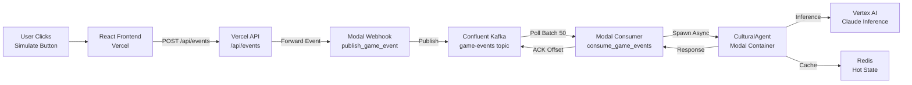

# Deployment Guide: Neuron Hybrid Stack

## Repository Structure

The repository is now organized into three distinct layers:

```
/
├── infra/                      # Cloud Backend (Modal + Kafka)
│   ├── modal_orchestrator.py  # Agent spawning & inference
│   ├── confluent_consumer.py  # Kafka event consumer
│   └── requirements.txt        # Modal dependencies
│
├── api/                        # Vercel Serverless Functions
│   ├── events.py               # HTTP bridge: Frontend → Kafka
│   └── requirements.txt        # Vercel dependencies
│
├── upload-why-not/             # Frontend (Vite/React)
│   ├── src/                    # React components
│   ├── vite.config.ts          # Vite configuration
│   └── package.json            # Node dependencies
│
├── src/                        # Python Core Logic (shared)
│   ├── core/                   # Agent factory, tempo engine
│   └── llm/                    # Vertex AI client
│
├── config/                     # Configuration
│   └── city_profiles.json      # 32 NFL city profiles
│
├── docs/                       # Documentation
│   ├── architecture.md         # System architecture
│   └── project_evolution.md    # Project history
│
└── vercel.json                 # Vercel routing config
```

---

## Deployment Order

> [!CAUTION]
> **Deploy in this EXACT order to avoid broken dependencies**

### Step 1: Deploy Cloud Infrastructure (Modal)

The backend must be deployed **first** because Vercel needs the Modal webhook URLs.

#### 1.1 Install Modal CLI

```bash
pip install modal
modal setup
```

#### 1.2 Configure Modal Secrets

Create three secrets in your Modal account:

**Redis Credentials:**
```bash
modal secret create redis-credentials \
  REDIS_URL=redis://your-redis-url:6379
```

**GCP Credentials:**
```bash
modal secret create gcp-credentials \
  GCP_PROJECT_ID=your-gcp-project-id
```

**Kafka Credentials:**
```bash
modal secret create kafka-credentials \
  BOOTSTRAP_SERVERS=pkc-xxxxx.us-east-1.aws.confluent.cloud:9092 \
  SASL_USERNAME=your-confluent-api-key \
  SASL_PASSWORD=your-confluent-api-secret
```

#### 1.3 Deploy Modal Orchestrator

```bash
cd /Users/shaliniananda/FANTASY\ FOOTBALL
modal deploy infra/modal_orchestrator.py
```

**Expected Output:**
```
✓ Created neuron-orchestrator
✓ Deployed 5 web endpoints:
  - https://[your-username]--neuron-orchestrator-generate-commentary.modal.run
  - https://[your-username]--neuron-orchestrator-publish-game-event.modal.run
  ...
```

**Save this URL:** Copy the `publish-game-event` webhook URL. You'll need it for Vercel.

#### 1.4 Deploy Kafka Consumer

```bash
modal deploy infra/confluent_consumer.py
```

**Expected Output:**
```
✓ Created neuron-kafka-consumer
✓ Deployed function: consume_game_events
✓ Deployed web endpoint: publish_game_event
```

#### 1.5 Start Kafka Consumer (Long-Running)

```bash
modal run infra/confluent_consumer.py::start_consumer
```

This starts the long-running consumer. Keep this running in a terminal or use Modal's dashboard to restart it.

---

### Step 2: Deploy Frontend + API (Vercel)

Now that the backend is running, deploy the frontend and API gateway.

#### 2.1 Install Vercel CLI

```bash
npm install -g vercel
```

#### 2.2 Configure Environment Variables

In your Vercel dashboard or via CLI, set:

```bash
vercel env add MODAL_KAFKA_WEBHOOK_URL production
```

**Value:** Paste the `publish_game_event` URL from Step 1.3 (e.g., `https://[user]--neuron-kafka-consumer-publish-game-event.modal.run`)

#### 2.3 Deploy to Vercel

```bash
cd /Users/shaliniananda/FANTASY\ FOOTBALL
vercel --prod
```

**Expected Output:**
```
✓ Deployed to production
🔗 https://your-app.vercel.app
```

#### 2.4 Verify API Endpoint

Test the Vercel API:

```bash
curl -X POST https://your-app.vercel.app/api/events \
  -H "Content-Type: application/json" \
  -d '{
    "city": "Philadelphia",
    "event_type": "test",
    "user_input": "Test event from deployment"
  }'
```

**Expected Response:**
```json
{
  "status": "success",
  "message": "Event published to Kafka",
  "data": { "status": "success", "city": "Philadelphia", ... }
}
```

---

## Architecture Flow (End-to-End)



**Latency Budget:**
- Frontend → Vercel API: ~50ms
- Vercel API → Modal Webhook: ~100ms
- Modal → Kafka Publish: <15ms
- Kafka → Consumer Poll: <10ms
- Consumer → Agent Spawn: <100ms
- Agent Inference: 150-200ms
- **Total:** <450ms (acceptable with async processing)

---

## Monitoring & Logs

### Modal Logs

**View orchestrator logs:**
```bash
modal logs neuron-orchestrator --follow
```

**View Kafka consumer logs:**
```bash
modal logs neuron-kafka-consumer --follow
```

### Vercel Logs

**View API logs:**
```bash
vercel logs --follow
```

Or use the Vercel dashboard: https://vercel.com/dashboard

### Confluent Cloud

Monitor Kafka topics, throughput, and lag:
- Dashboard: https://confluent.cloud
- Check consumer group `neuron-agents` for lag metrics

---

## Testing the Full Pipeline

### 1. Test Modal Orchestrator Directly

```bash
curl -X POST https://[your-modal-url].modal.run/generate_commentary \
  -H "Content-Type: application/json" \
  -d '{
    "city": "Dallas",
    "user_input": "What do you think about the Cowboys?"
  }'
```

### 2. Test Kafka Producer (Modal)

```bash
curl -X POST https://[your-modal-url].modal.run/publish_game_event \
  -H "Content-Type: application/json" \
  -d '{
    "city": "Philadelphia",
    "event_type": "touchdown",
    "user_input": "TOUCHDOWN!",
    "game_context": {"score": "21-14", "quarter": 3}
  }'
```

Check Kafka consumer logs to see if event was processed.

### 3. Test Vercel API

```bash
curl -X POST https://your-app.vercel.app/api/events \
  -H "Content-Type: application/json" \
  -d '{
    "city": "New York",
    "event_type": "interception"
  }'
```

### 4. Test Frontend Integration

1. Open `https://your-app.vercel.app` in browser
2. Click "Simulate Event" button
3. Check browser console for API response
4. Check Modal logs for agent spawning
5. Check Kafka consumer forprocessing

---

## Troubleshooting

### Issue: "MODAL_KAFKA_WEBHOOK_URL not set"

**Solution:** Set the environment variable in Vercel:
```bash
vercel env add MODAL_KAFKA_WEBHOOK_URL production
```

### Issue: "Failed to connect to Redis"

**Solution:** Verify Redis credentials in Modal secrets:
```bash
modal secret list
```

If missing, create it:
```bash
modal secret create redis-credentials REDIS_URL=redis://...
```

### Issue: "Kafka authentication failed"

**Solution:** Check Confluent Cloud credentials:
```bash
modal secret list kafka-credentials
```

Verify `SASL_USERNAME` and `SASL_PASSWORD` are correct.

### Issue: "Consumer lag building up"

**Solution:** Scale up Kafka partitions or Modal consumers:
1. Increase Kafka partitions in Confluent Cloud dashboard
2. Increase `keep_warm` in `confluent_consumer.py` (currently 1, increase to 3-5)
3. Redeploy: `modal deploy infra/confluent_consumer.py`

### Issue: "Vercel API timeout"

**Solution:** Increase timeout in `api/events.py`:
```python
response = requests.post(
    modal_webhook_url,
    json=event_data,
    timeout=30  # Increase from 10 to 30 seconds
)
```

---

## Cost Optimization

### Modal

- **Free tier:** 30 CPU-hours/month
- **Paid:** $0.000033/CPU-second (~$0.12/hour)
- **Recommendation:** Use `keep_warm=10` only during peak traffic (NFL Sundays)

### Confluent Kafka

- **Credit:** $3,000 available
- **Usage:** ~$0.11/GB ingress, $0.11/GB egress
- **Recommendation:** Set retention to 24 hours (not 7 days) to save storage costs

### Vercel

- **Free tier:** 100GB bandwidth/month
- **Paid:** Pro plan at $20/month (includes 1TB bandwidth)
- **Recommendation:** Start with free tier, upgrade if >100GB/month

### Vertex AI

- **Cost:** ~$3.75/million characters (Claude 3.5 Sonnet)
- **Recommendation:** Use caching in Redis to reduce inference costs

---

## Next Steps

1. ✅ Deploy Modal infrastructure
2. ✅ Deploy Vercel frontend + API
3. ⏳ **Set up monitoring dashboards** (Grafana + Prometheus)
4. ⏳ **Configure auto-scaling** for FIFA 2026 (5,000+ creators)
5. ⏳ **Implement A/B testing** for different city personalities
6. ⏳ **Add authentication** (OAuth for creator accounts)

---

**Document Version:** 1.0  
**Last Updated:** 2025-12-02  
**Maintained By:** Based on [docs/architecture.md](file:///Users/shaliniananda/FANTASY%20FOOTBALL/docs/architecture.md)
