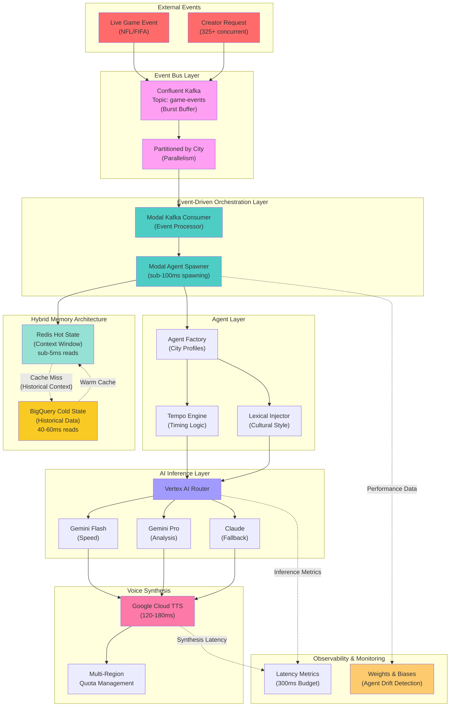

# Neuron Hybrid Stack Architecture

> [!IMPORTANT]
> This architecture supports the evolution from NFL-only (325+ creators, 1,950 agents) to global infrastructure (FIFA 2026: 5,000 creators, 30,000 agents) while maintaining <300ms total system latency.

## System Overview

The Neuron Hybrid Stack is an event-driven, multi-agent orchestration platform designed for real-time sports commentary and analysis. It combines cultural reasoning engines with distributed cognition at global scale.

### Core Requirements

- **Concurrency:** 325+ concurrent creators (current), scaling to 5,000+ (FIFA 2026)
- **Latency:** <300ms total system latency
- **Agent Density:** 2-6 agents per creator
- **Voice Synthesis:** Multi-region support with 120-180ms latency
- **Memory Consistency:** Hot/Cold state separation for real-time performance

## Architecture Diagram



## Event-Driven Flow

### 1. Event Ingestion (Confluent Kafka)
```
Live Game Event → Kafka Topic (game-events) → Modal Consumer
```

**Latency Budget:** <15ms  
**Role:** Confluent Kafka acts as a durable event bus that buffers burst traffic during high-concurrency moments (touchdowns, goals, dramatic plays). This prevents overwhelming Modal with 325+ simultaneous creator requests.

**Kafka Configuration:**
- **Topic:** `game-events` (partitioned by city for parallelism)
- **Partitions:** 32 partitions (one per NFL city, expandable to 48 for FIFA 2026)
- **Replication:** 3x replication for fault tolerance
- **Retention:** 24 hours (replay capability for debugging)

**Why Confluent Kafka:**
- **Burst Handling:** Touchdown events can trigger 100+ creator requests within 2 seconds. Kafka buffers these without dropped events.
- **Ordered Delivery:** Per-partition ordering ensures game events are processed sequentially per city.
- **Backpressure Management:** If Modal consumers are overloaded, Kafka holds events in the queue.
- **Observability:** Confluent Cloud provides real-time metrics on lag, throughput, and partition health.

**Trigger Types:**
- Game state changes (touchdowns, goals, fouls, injuries)
- Creator requests (commentary generation, analysis, reactions)
- Scheduled triggers (pre-game, halftime, post-game summaries)

### 2. Event Consumption (Modal Kafka Consumer)
```
Kafka Topic → Modal Consumer → Agent Spawner
```

**Modal Consumer Configuration:**
- Subscribes to `game-events` topic
- Consumer group: `neuron-agents` (auto-rebalancing)
- Processes events in parallel across partitions
- ACKs messages only after successful agent response

**Consumer Logic:**
1. Poll Kafka for new events (batch of up to 100 events)
2. Deserialize event payload (city, event_type, context)
3. Spawn Modal agent container for each event
4. Return commentary response
5. ACK event to Kafka (commits offset)

### 3. Container Spawning (Modal)
```
Modal Consumer → Agent Containers (sub-100ms cold start)
```

**Why Modal:**
- Traditional containers: 2-4s cold starts → cascade failures
- Modal: <100ms spawning → handles 325+ concurrent creators
- Event-driven: Only spawn when needed, auto-scale down
- Kafka integration: Native support for Kafka consumers

**Configuration:**
- Read agent profiles from Redis (sub-5ms)
- Load city-specific cultural reasoning templates
- Initialize tempo/lexical engines

### 4. Hot State Management (Redis)
```
Agent → Redis Hot State (Context Window, Current Game State)
```

**Data Stored:**
- Current conversation context (last N turns)
- Live game score/stats
- Agent configuration (city profiles)
- Active creator sessions

**Latency:** Sub-5ms reads, <10ms writes  
**TTL:** 4 hours (game duration + buffer)

### 5. Cold State Retrieval (BigQuery)
```
Redis Cache Miss → BigQuery Historical Data → Warm Redis
```

**Data Stored:**
- Season statistics
- Historical player performance
- Creator preference history
- Long-term agent memory

**Latency:** 40-60ms (acceptable for non-critical path)  
**Pattern:** Read-through cache (only on cache miss)

### 6. AI Inference (Vertex AI)
```
Agent → Vertex AI Router → Gemini Flash/Pro/Claude → Response
```

**Routing Logic:**
- **Gemini Flash:** Real-time commentary (speed-critical, <200ms)
- **Gemini Pro:** Deep analysis (accuracy-critical, <500ms acceptable)
- **Claude:** Fallback for quota exhaustion

**Latency Budget:** 150-200ms (largest component of 300ms total)

### 7. Voice Synthesis (Google Cloud TTS)
```
Text Response → Google Cloud TTS → Audio Output (120-180ms)
```

**Multi-Region Strategy:**
- Primary: `us-central1` (NFL traffic)
- Overflow: `us-east1`, `us-west1`
- FIFA 2026: Add `europe-west1`, `asia-northeast1`

**Quota Management:**
- 325 creators × 6 agents × 2 requests/min = ~4,000 req/min
- Distribute across 3+ regions to avoid throttling

## Latency Breakdown (300ms Budget)

| Component | Target Latency | Critical Path |
|-----------|----------------|---------------|
| Event → Kafka Publish | <5ms | Yes |
| Kafka → Modal Consumer | <10ms | Yes |
| Modal Consumer → Agent Spawn | <5ms | Yes |
| Redis Read (Hot State) | <5ms | Yes |
| BigQuery Read (Cold State) | 40-60ms | No (cache miss only) |
| Vertex AI Inference | 150-200ms | Yes |
| Google Cloud TTS | 120-180ms | Yes (parallel with inference) |
| **Total (Critical Path)** | **<300ms** | ✓ |

## Scalability Projections

### Current State (NFL Season)
- **Creators:** 325+
- **Active Agents:** 1,950 (6 agents/creator avg)
- **Peak Concurrency:** Sunday/Monday primetime
- **Latency:** <300ms maintained ✓

### Future State (FIFA 2026)
- **Creators:** 5,000+
- **Active Agents:** 30,000 (6 agents/creator avg)
- **Peak Concurrency:** Tournament matches (simultaneous games)
- **Latency Target:** <300ms (requires horizontal scaling)

**Scaling Strategy:**
1. **Kafka:** Increase partitions from 32 → 48 (FIFA 2026 nations)
2. **Modal:** Auto-scales containers (no code changes needed)
3. **Redis:** Shard by creator region (48 nations → regional clusters)
4. **Vertex AI:** Multi-region deployment + quota increases
5. **Google TTS:** Pre-provision regional quotas

## Failure Modes & Mitigations

### Cold Start Cascades
**Problem:** One stalled agent collapses entire chain  
**Solution:** Modal's sub-100ms spawning + independent agent lifecycles

### Memory Inconsistency
**Problem:** Agents contradict each other under pressure  
**Solution:** Redis as single source of truth for hot state

### Concurrency Spikes
**Problem:** Fine at 5 users, fails at 300  
**Solution:** Kafka buffers burst traffic + Modal auto-scaling + consumer backpressure

### Voice Synthesis Quotas
**Problem:** Regional quota exhaustion during peak traffic  
**Solution:** Multi-region routing + graceful degradation (text-only fallback)

## Observability Strategy

### Agent Drift Detection (Weights & Biases)
- Track cultural reasoning consistency over time
- Monitor tempo/lexical adherence to city profiles
- Alert on personality drift (e.g., Boston agent becoming too polite)

### Latency Monitoring
- P50/P95/P99 latency by component
- Real-time alerting on >300ms breaches
- Regional latency heatmaps

### Cost Optimization
- Inference cost per agent per creator
- Voice synthesis cost by region
- Redis vs BigQuery read ratio (optimize for hot path)

## Technology Stack Summary

| Layer | Technology | Purpose | Latency | Scaling |
|-------|-----------|---------|---------|---------|
| **Event Bus** | Confluent Kafka | Durable event stream | <15ms | Partitioning (32→48) |
| **Orchestration** | Modal | Event-driven spawning | <100ms | Auto-scale |
| **Hot Memory** | Redis | Context window | <5ms | Sharding |
| **Cold Memory** | BigQuery | Historical data | 40-60ms | Partitioning |
| **Inference** | Vertex AI (Gemini/Claude) | AI reasoning | 150-200ms | Multi-region |
| **Voice** | Google Cloud TTS | Synthesis | 120-180ms | Regional quotas |
| **Observability** | Weights & Biases | Drift detection | N/A | SaaS |

## Cultural Reasoning Integration

Each agent is instantiated with city-specific profiles from [config/city_profiles.json](file:///Users/shaliniananda/FANTASY%20FOOTBALL/config/city_profiles.json):

- **Tempo Engine:** Controls pacing (Dallas: +35% interruptions vs Kansas City: +5%)
- **Lexical Injector:** Injects regional phrases at configured rates
- **Evidence Weights:** Prioritizes reasoning types (historical vs emotional vs statistical)
- **Memory Depth:** Tunes context window size per cultural style

This ensures that a Brazilian FIFA agent reasons differently from a Japanese agent, even when using the same base model.

## Next Steps

> [!CAUTION]
> Before scaling to FIFA 2026, validate the following under load:
> 1. Modal spawning at 5,000 concurrent creators (10x current)
> 2. Redis sharding strategy for 48-nation distribution
> 3. Vertex AI quota negotiations for 30,000-agent inference
> 4. Multi-region TTS provisioning and failover logic

---

**Document Status:** Source of truth for Neuron Hybrid Stack architecture  
**Last Updated:** 2025-12-02  
**Owner:** Based on [docs/project_evolution.md](file:///Users/shaliniananda/FANTASY%20FOOTBALL/docs/project_evolution.md)
