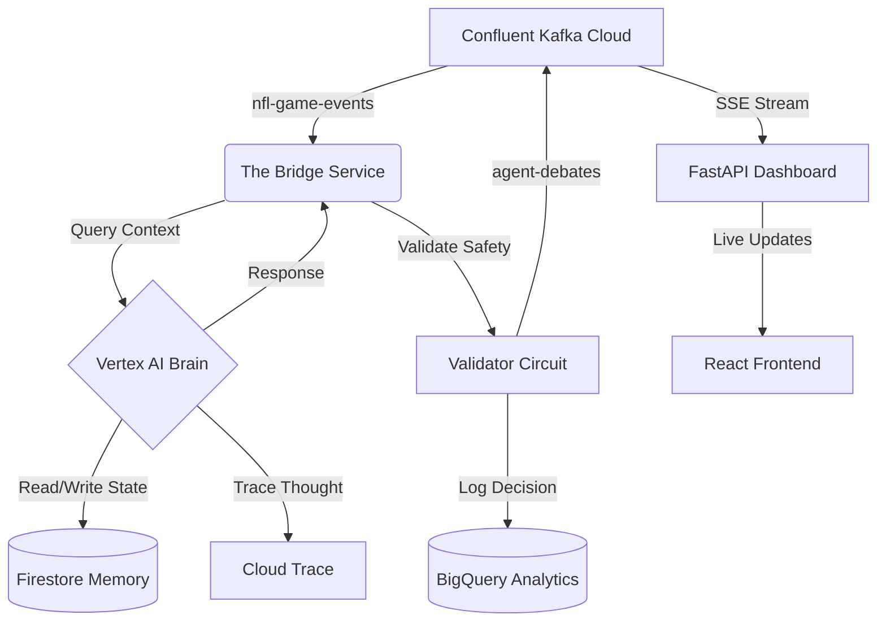

# 🧠 Neuron: Distributed Cognitive Architecture

> *"Real-time data unlocks real-world experiences."*

**Neuron** is a distributed cognitive architecture designed for high-velocity event processing (e.g., live NFL/FIFA games). Unlike standard chatbots that wait for user input, Neuron actively listens to real-time data streams, reasons about game state using Google Vertex AI, and autonomously broadcasts commentary to thousands of users via Confluent Kafka.

---

## ◆ The Triangle Architecture

Neuron decouples **Data (The River)**, **Intelligence (The Brain)**, and **Presentation (The View)** into a scalable triangle.



---

## ◆ Key Capabilities

### 1. The Moving River (Confluent Kafka)
The **nervous system** of the architecture. Game events (`Touchdown`, `Penalty`) flow in via `nfl-game-events`. Neuron processes them and emits standardized commentary to `agent-debates`, enabling a decoupled, event-driven design.

### 2. The Cognitive Brain (Vertex AI Agent Engine)
Neuron runs as a serverless **Reasoning Engine** on Google Cloud.
- **Object Permanence:** Uses Firestore to maintain long-term memory across server restarts.
- **Brain Scan:** Every thought is instrumented with OpenTelemetry and visible in Google Cloud Trace.
- **Vision:** Can analyze video clips (MP4) to determine penalties using Gemini 1.5 Pro.

### 3. The Chameleon (Cultural Routing)
Neuron adapts its personality based on the user's locale.
- 🇺🇸 `en-US`: Stoic, stat-heavy analysis.
- 🇧🇷 `pt-BR`: High-energy, emotional "GOOOOL" style commentary.
- 🇬🇧 `en-GB`: Dry, sarcastic punditry.

### 4. The Safety Net (Compliance & Analytics)
- **Circuit Breaker:** A specialized `ValidatorAgent` intercepts all outputs. If "hallucination" or "toxic" content is detected, the pipeline is blocked immediately.
- **Black Box:** Every passed or blocked message is logged to BigQuery for post-game analysis.

---

## ◆ Installation & Setup

### Prerequisites
- Python 3.10+
- Google Cloud Project (with Vertex AI, Firestore, BigQuery enabled)
- Confluent Cloud Cluster

### 1. Install Core Framework
```bash
pip install -e .
```

### 2. Configure Environment
Create a `.env` file or export variables:
```bash
export GOOGLE_CLOUD_PROJECT="your-project-id"
export CONFLUENT_BOOTSTRAP="pkc-xyz.us-east1.gcp.confluent.cloud:9092"
export CONFLUENT_API_KEY="your-key"
export CONFLUENT_API_SECRET="your-secret"
```

### 3. Deploy the Brain (Vertex AI)
Ship the cognitive core to Google Cloud:
```bash
python3 vertex_deployment/deploy.py
```

---

## ◆ Running the Demo (The Triangle)

Open **3 Terminals** to activate the System.

### Terminal 1: The React Dashboard (Frontend)
Displays the live debate feed with real-time glow effects.
```bash
cd frontend
python3 -m http.server 3000
# Open http://localhost:3000/dashboard.html
```

### Terminal 2: The SSE Bridge (API)
Connects the Kafka stream to the Browser via Server-Sent Events.
```bash
python3 services/dashboard_api.py
```

### Terminal 3: The Neural Bridge (Backend)
Connects the Kafka stream to the Vertex AI Brain.
```bash
python3 services/kafka_bridge.py
```

---

## ◆ The 10-Day Sprint Log

| Day | Module | Status | Deliverable |
|-----|--------|--------|-------------|
| Day 1 | Biology | 🟢 | Deployed `neuron_core` to Vertex AI Agent Engine. |
| Day 2 | Memory | 🟢 | Integrated Firestore for persistent agent state. |
| Day 3 | Vision | 🟢 | Enabled Cloud Trace (OpenTelemetry) for full observability. |
| Day 4 | Perception | 🟢 | Built "Referee Bot" (Video Analysis) with Gemini 1.5. |
| Day 5 | The River | 🟢 | Connected Confluent Cloud (Kafka) pipeline. |
| Day 6 | Safety | 🟢 | Implemented Validator Agents & BigQuery Sinks. |
| Day 7 | Tools | 🟢 | Built MCP Server for dynamic tool discovery. |
| Day 8 | Skill | 🟢 | Enabled Code Execution for self-writing Python tools. |
| Day 9 | Culture | 🟢 | Implemented Locale-based Personality Injection. |
| Day 10 | Presentation | 🟢 | Real-time React Dashboard via SSE. |

---

**Built by Shalini Ananda PhD**  
**Powered by Google Vertex AI × Confluent**
